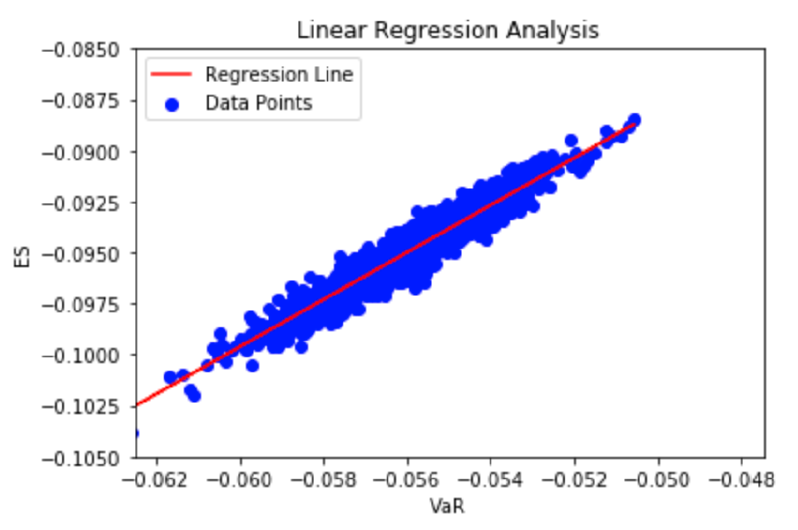

# 📈 Shanghai Stock Exchange (SSE) Risk Analysis


## 🎯 Project Overview

This project performs an advanced statistical analysis of the Shanghai Stock Exchange (SSE) Composite Index using Bayesian inference and Gibbs sampling for financial risk assessment.

## 📐 Mathematical Framework

### 1. Logarithmic Returns
The foundation of our analysis begins with calculating logarithmic returns:

$R_t = \ln(\frac{P_t}{P_{t-1}})$

where:
- $R_t$ is the logarithmic return at time t
- $P_t$ is the present value
- $P_{t-1}$ is the past value

### 2. Bayesian Parameter Estimation
We employ a Bayesian framework with the following prior distributions:

For the mean (μ):
$\mu_{prior} \sim \mathcal{N}(0, 10000)$

For the precision (τ):
$\tau_{prior} \sim Gamma(1, 1000)$

### 3. Gibbs Sampling
The conditional distributions for Gibbs sampling are:

For μ given τ:
$\mu|\tau,y \sim \mathcal{N}(\frac{\tau\sum y_i + \mu_0/\sigma_0^2}{\tau n + 1/\sigma_0^2}, \frac{1}{\tau n + 1/\sigma_0^2})$

For τ given μ:
$\tau|\mu,y \sim Gamma(\alpha + \frac{n}{2}, \beta + \frac{1}{2}\sum(y_i-\mu)^2)$

### 4. Risk Metrics

#### Value at Risk (VaR)
$VaR_{\alpha} = \mu + z_{\alpha}\sigma$

where:
- $z_{\alpha}$ is the α-quantile of the standard normal distribution
- μ is the mean
- σ is the standard deviation

#### Expected Shortfall (ES)
$ES_{\alpha} = \mu + \frac{\phi(z_{\alpha})}{\alpha}\sigma$

where:
- $\phi(z_{\alpha})$ is the standard normal probability density function at $z_{\alpha}$

## 🛠️ Technical Implementation

### Data Processing Pipeline


## 📊 Analysis Results & Visualizations

### 1. Distribution of Log Returns
This visualization shows the distribution of logarithmic returns, demonstrating its approximate normal distribution as supported by the law of large numbers.

<div align="center">

</div>

### 2. Parameter Convergence from Gibbs Sampling
These plots show the convergence of μ and τ parameters through the Gibbs sampling process:

<div align="center">

</div>

Key observations:
- Stable convergence achieved after burn-in period
- Clear stationary distribution for both parameters
- Efficient mixing in the Markov chains

### 3. Autocorrelation Function (ACF) Analysis
The ACF plots validate our distribution by showing the decay of autocorrelation over different lags:

<div align="center">

</div>

Insights:
- Rapid decay of autocorrelation indicates good sampling efficiency
- Values approaching zero at higher lags confirm independence
- Validation of the Markov chain's mixing properties

### 4. VaR and ES Correlation Analysis
The scatter plot demonstrates the strong linear relationship between VaR and ES metrics:

<div align="center">

</div>

Key findings:
- Strong positive correlation (ρ = 0.946)
- Higher density in middle ranges
- Consistent relationship across different risk levels

### 5. Implementation Code for Visualization

```python
def create_visualizations(data, gibbs_results, var_values, es_values):
    # Create figure directory if it doesn't exist
    Path("results/figures").mkdir(parents=True, exist_ok=True)
    
    # 1. Log Returns Distribution
    plt.figure(figsize=(10, 6))
    sns.histplot(data=data['log_returns'], kde=True)
    plt.title('Distribution of Log Returns')
    plt.xlabel('Log Returns')
    plt.ylabel('Frequency')
    plt.savefig('results/figures/log_returns_dist.png')
    plt.close()
    
    # 2. Gibbs Sampling Convergence
    fig, (ax1, ax2) = plt.subplots(2, 1, figsize=(10, 8))
    ax1.plot(gibbs_results['mu'])
    ax1.set_title('μ Convergence')
    ax2.plot(gibbs_results['tau'])
    ax2.set_title('τ Convergence')
    plt.tight_layout()
    plt.savefig('results/figures/gibbs_convergence.png')
    plt.close()
    
    # 3. ACF Plot
    plot_acf(gibbs_results['mu'][100:], lags=40)
    plt.title('Autocorrelation Function for μ')
    plt.savefig('results/figures/acf_plot.png')
    plt.close()
    
    # 4. VaR-ES Correlation
    plt.figure(figsize=(10, 6))
    plt.scatter(var_values, es_values, alpha=0.5)
    plt.xlabel('Value at Risk (VaR)')
    plt.ylabel('Expected Shortfall (ES)')
    plt.title('Correlation between VaR and ES')
    plt.savefig('results/figures/var_es_correlation.png')
    plt.close()
```


## 🚀 Getting Started

### Prerequisites
```python
pip install -r requirements.txt
```

Required packages:
- pandas>=1.3.0
- numpy>=1.20.0
- scipy>=1.7.0
- matplotlib>=3.4.0
- seaborn>=0.11.0
- statsmodels>=0.13.0

### Running the Analysis
```bash
# Clone repository
git clone https://github.com/yourusername/sse-analysis.git

# Navigate to project directory
cd sse-analysis

# Run main analysis
python src/main.py
```

## 📊 Results

### Key Findings
- Correlation Coefficient between VaR and ES: 0.946
- Convergence achieved after 100 iterations
- Stable parameter estimates:
  $\hat{\mu} = \frac{1}{N}\sum_{i=1}^N \mu^{(i)}$
  $\hat{\tau} = \frac{1}{N}\sum_{i=1}^N \tau^{(i)}$

## 📚 References

1. For the Gibbs Sampling methodology:
   Peng, R. D. (2022). Advanced Statistical Computing

2. For logarithmic returns calculation:
   Saturn Cloud. (2024). What are logarithmic returns and how to calculate them in pandas dataframe?

## 📫 Contact

- **Author**: [Abby Wang]
- **Email**: [sw546@duke.edu]
- **LinkedIn**: [https://www.linkedin.com/in/siyuan-wang-abby/]


---
⭐ If you find this project useful, please consider giving it a star!
